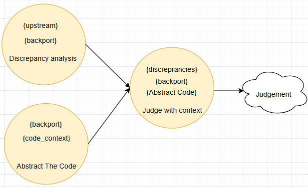

# Backport Patch Validator (Proof-of-Concept version)

The goal of this project is to ensure that the backported patches maintain their intent, logic and security of the original upstream changes, while adapting them to the target version of the codebase. In essense, the project uses 3 prompt approach to refine the context and provide better guidance to the LLMs. 

"Discarded Experiments" folder contains some failed attempts, that either overcomplicated the project or were otherwise unfruitful. 

#### Prerequisites
 - Python 3.12
 - API keys for [OpenRouter](https://openrouter.ai/)

#### Running the Script
- python -m venv venv
- Activate the venv
   - windows: (venv\Scripts\activate)
   - linux: (source venv/bin/activate)
- pip install -r requirements.txt
- add the OpenRouter API key to .env file
- python JudgeJuryExecutioner\JuryExecutioner.py

finally, Check the output files (verdicts_JudgeJuryExecutioner.csv and verification_results.txt) for results.

## Workflow Overview

for each task, an appropriate free LLM model was chosen. (the API keys can be generated by creating a free account on openrouter.ai)
1) Discrepancy Analysis -> deepseek-R1 model (Strong Reasoning)
2) Code Abstraction -> deepseek-v3 (Solid Code understanding, without overthinking of the R1 model) 
3) Final Judgement -> Gemini 2.0 (large context reasoning ability)

### Key Components
- **JuryExecutioner.py**: Main script for processing patches.
- **Judge.py**: Handles AI-based reasoning and validation.
- **prompts.py**: Contains prompts for AI models.
- **parser.py**: Utility functions for parsing and writing results.

#### **JuryExecutioner.py**
The main script that orchestrates patch validation. It processes `upstream.patch`, `backporter.patch`, and `target_code` files, and writes results to CSV and text files.

#### Key Functions:
- **`get_verdict(result)`**: Determines verdict based on the `is_correct` field.
- **`process_patches()`**: Parses patches, compares files, and writes results.
- **`main()`**: Iterates over samples, processes patches, and compares verdicts.

---

#### **Judge.py**
Handles AI-based reasoning and validation using the OpenRouter API.

#### Key Functions:
- **`_call_api()`**: Makes API calls to OpenRouter.
- **`compare_intent()`**: Compares intent of upstream and backported patches.
- **`abstract_code_context()`**: Abstracts target code for relevant context.
- **`validate_with_context()`**: Validates discrepancies using abstracted code.
- **`process_backport()`**: Orchestrates comparison, abstraction, and validation.

---

#### **prompts.py**
Contains prompts for AI models to analyze and validate patches.

#### Key Prompts:
- **`COMPARE_INTENT_PROMPT`**: Analyzes discrepancies in intent and logic.
- **`ABSTRACT_CODE_PROMPT`**: Abstracts target code for focused context.
- **`VALIDATE_WITH_CONTEXT_PROMPT`**: Validates discrepancies using abstracted target code and provides verdicts.

---

#### **parser.py**
Utility functions for parsing, JSON repair, and writing results.

#### Key Functions:
- **`repair_json()`**: Fixes malformed JSON responses.
- **`get_file_from_path()`**: Finds files in patch sets.
- **`create_csv()`**: Appends verdicts to CSV.
- **`compare_verdicts()`**: Compares verdicts between CSV files.
- **`write_verification_results_txt()`**: Writes detailed results to text files.

